## First real day in Tokyo!

Second day in Japan! More like the first day, really, since we arrived last night. Pictures still yet to be taken, nevermind put on this blog. With my laptop that I bought recently, it came with a free pocket-camera. Before I use it I need a micro-SD card, so my mission is to get that. Unfortunately, we woke up really early thanks to jet-lag so everything’s shut. I woke up at 5am. Everything seems to open from 8-10.

Weirdly, seemingly no one uses headphones/earphones. Nevermind I just saw a couple, but it’s far less ubiquitous than in New Zealand where it feels like a 50/50 split of people with/without them.

Today we went to the packaging museum, it was just a corporate front and barely counted as a museum. Then, we went to a sushi train place called Uobei. 

Pictures! It’s the end of the day and goodness, I am tired.

Here's my hotel room:
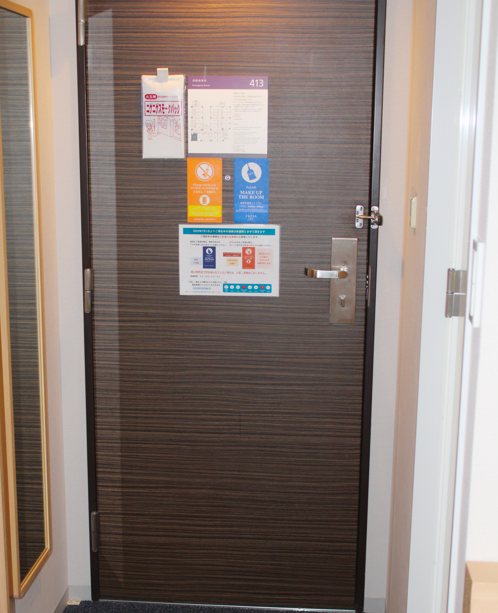
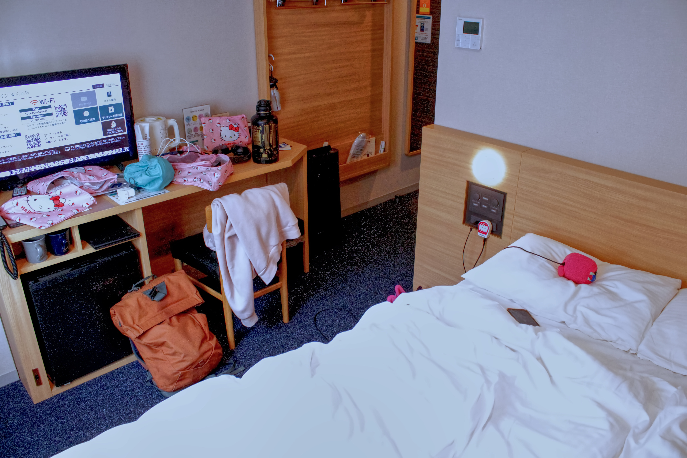

Here's a few photos I think are neat:

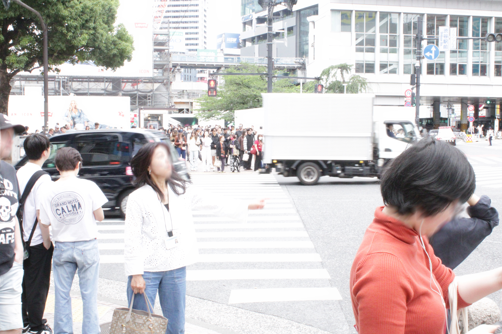
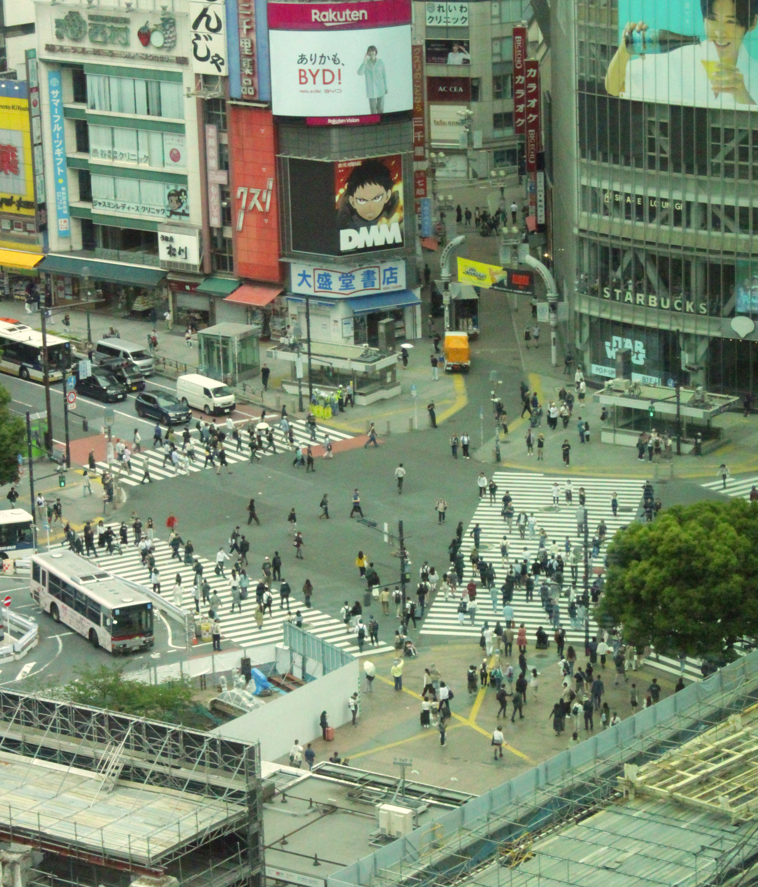

First we went to the Packaging Museum, it turned out to be pretty rubbish. That's not a bad joke it was pretty disappointing. Well, before this we went to a cafe near our hotel and wandered around a bit.
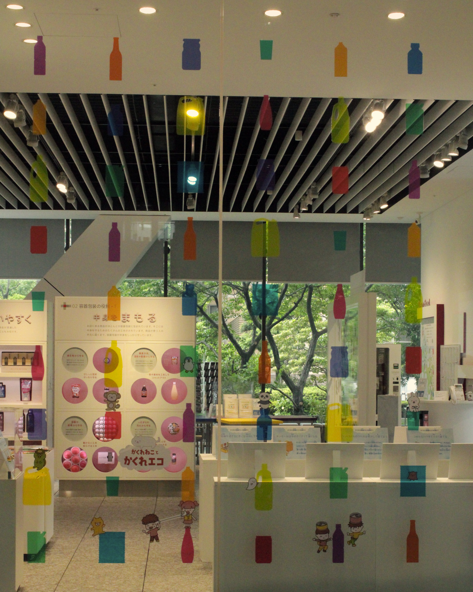
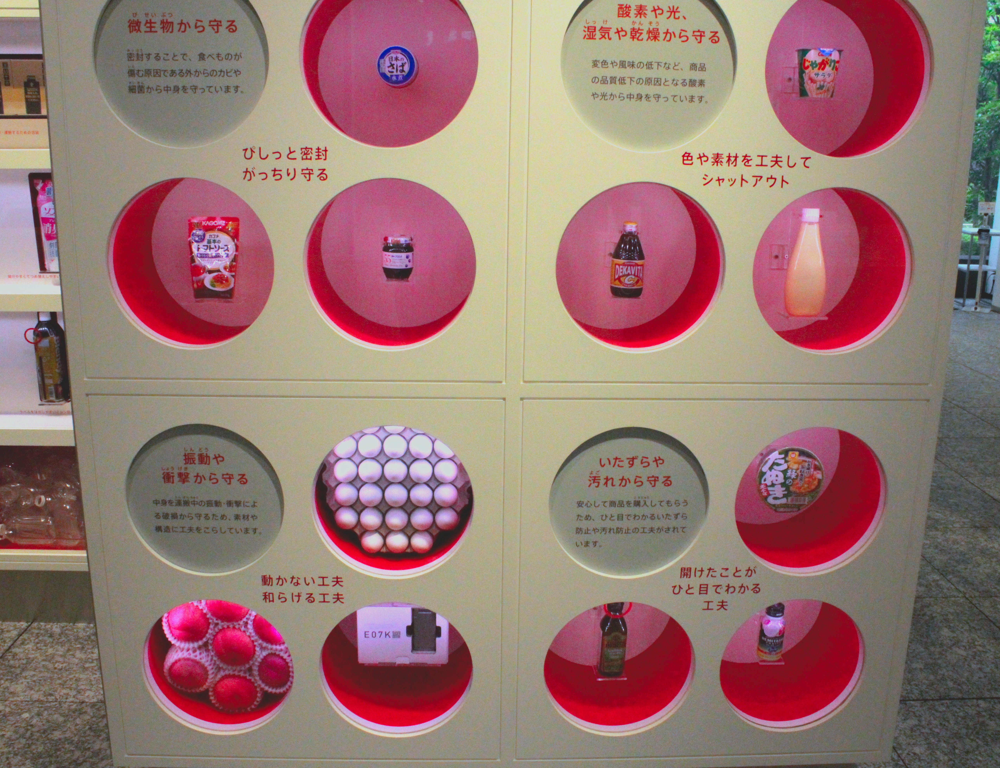

Then we went to this pretty bad sushi train place. My parents and their friend loved it but I thought it was a bit duff. I much prefer our Wellington's Kazu Sushi-Go-Round. I found out I have a distaste for seafood, but salted fish guts aren't too bad actually, my favorite seafood I've had in a long time, which isn't saying much.

In the final part of the day we went to this huge Muji:
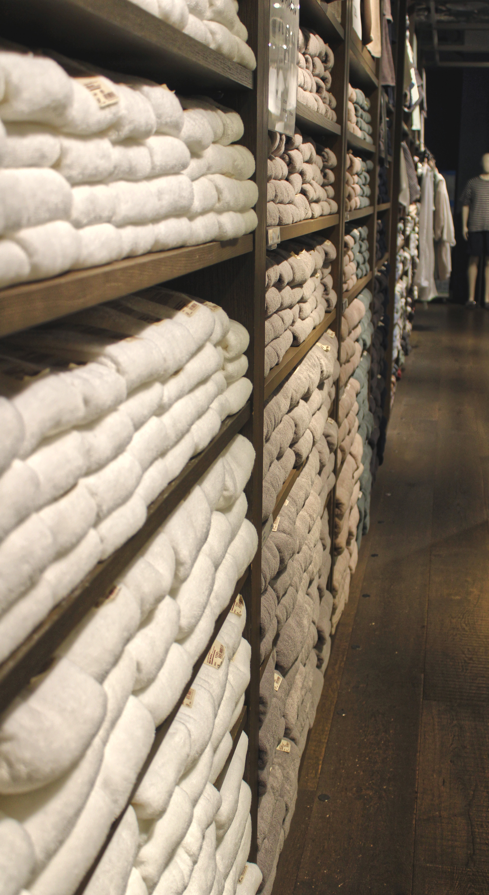
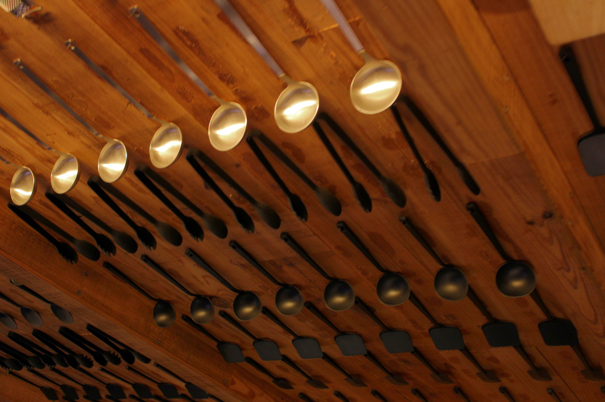
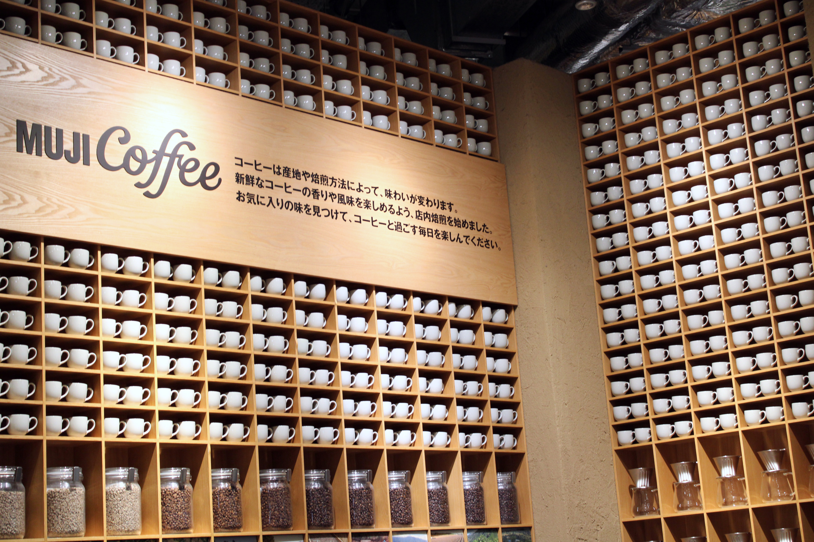

I left pretty quickly as nothing there interested me very much, it's more for if you've settled down in Japan. I went to a Sanrio store while the others shopped around and bought some stuff:
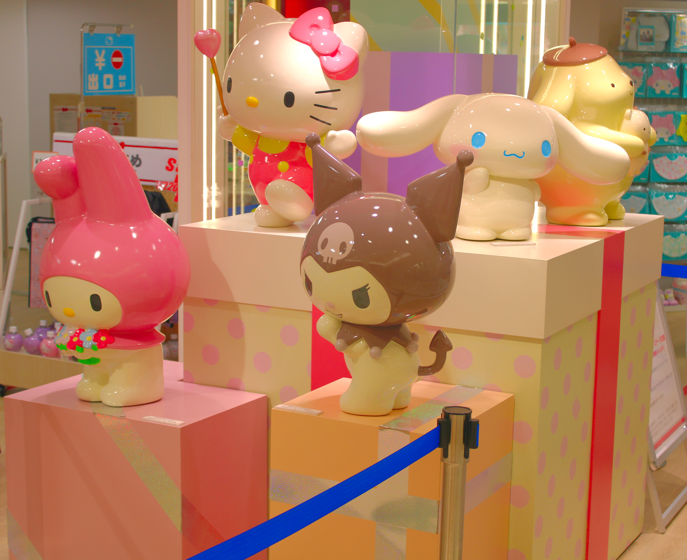
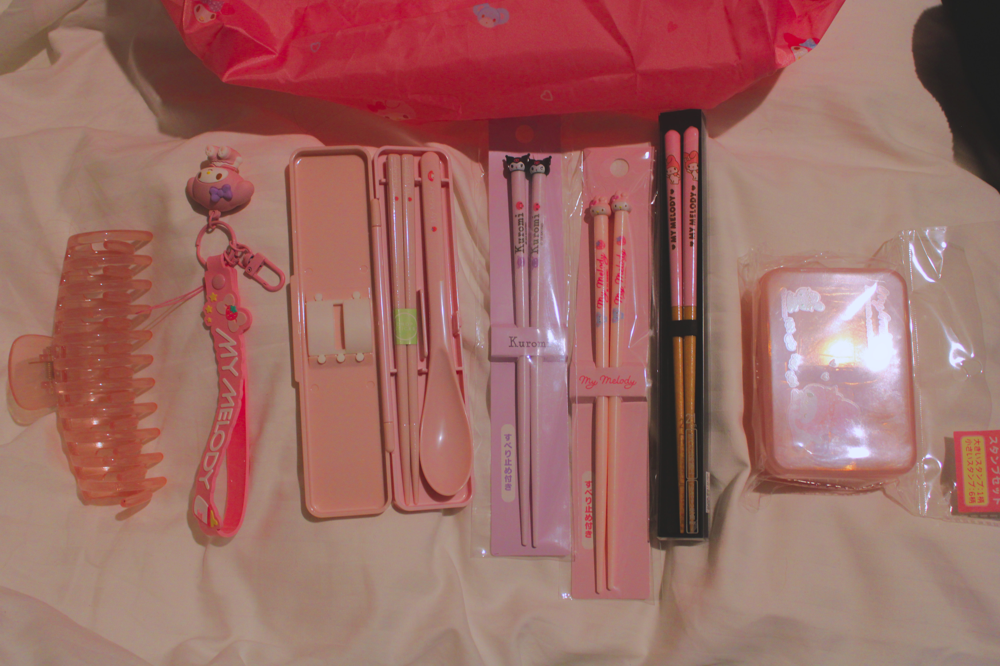

We then went home (back to our hotel), we split up and myself and my mum went to a 7-i (some sort of 7-11 offshoot/split company) and got some food, and the other two went to eat out. You can tell who's more wiped from the journey and jet lag from that split.

That's about what we did for the day! Tons of shopping and seeing various things, lots of funky (as in bad) smells too. There's almost certainly details I'm forgetting but yeah. Also, I painstakingly edited all of those photos, so be grateful because they look a lot better than they would have otherwise. It was pretty fun process to be fair.