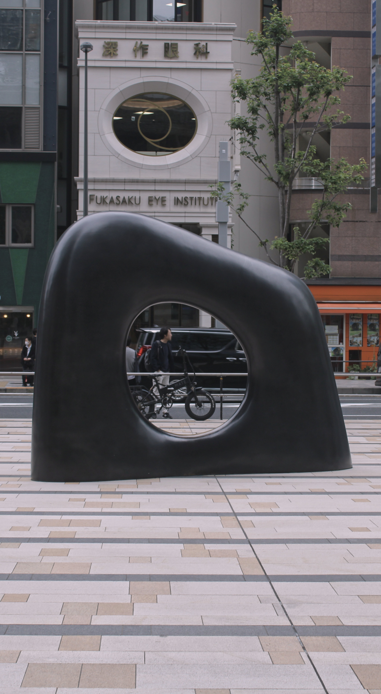
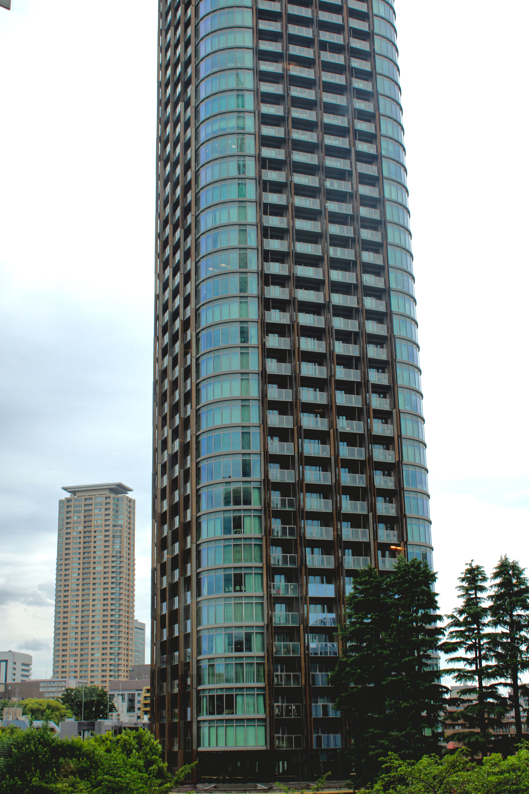

So, today we've done some good stuff! It's only 6pm as of writing, so more is to come.

## TeamLab Borderless

We started the day with breakfast, I had something left over from yesterday's trip to 7-i. Then, we went to TeamLab Boundless. It was genuinely amazing, I would highly, highly recommend checking out some sort of TeamLab thing if you visit Japan, there are three.

Here's some **completely unprocessed** photos of that!

There are many more photos, but they mostly turned out poorly because the projections on the walls of the transitory spaces were all smeared in photos.

It was a magical experience, I explored all of it. The photos don't do it justice. There were some things I did not like about it, however. The 3D animation of the frogs and people walking around on the walls was kinda ass. Well, that's about all of my complaints, but still, you think they'd hire some more/better 3D animators for this kinda thing. They painfully clearly reused animations literally constantly, they only had like 2 of them for each creature, and there were only like 3 creatures. Each of those animation's quality was just stiff and not lifelike at all. Genuinely, I could do better with a few hours, I have done better with a few hours. It's sad that this high quality of an experience was let down by such an easy to fix issue.

Here's some more cool photos from my travels:

I'm just going to upload what I have now, even though it's only 7pm. But yeah, fun day!