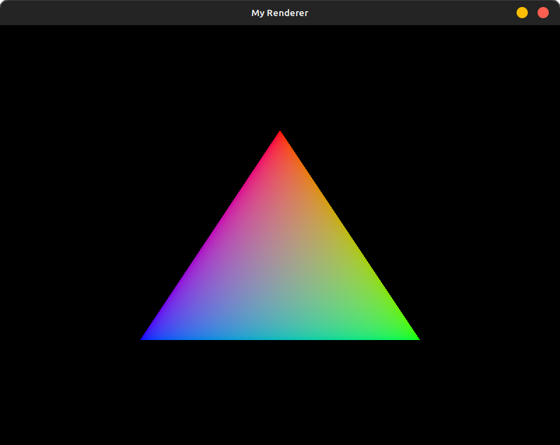

# Vulkan Triangle

This. This is a triangle. This is a triangle I MADE IN VULKAN!!!

Over 1000 lines of code for this damn triangle!

Holy-moley. I am a changed person. Jeez. WTF.

In OpenGL this was like, 100 lines of code, no big deal. 

But oh my lord. I have been reading and following a book and it took so many chapters and words and reading and writing to get to this point. The OpenGL book was done with a triangle after like 3 chapters, this was much worse.

I've been following [vulkan-tutorial.com](https://vulkan-tutorial.com). 

If you're interested in computer graphics, start with [learnopengl.com](https://learnopengl.com). But first, get your programming basics down before diving into that, I don't know how I learned that stuff it's all over the place, just *never* use one of those goddamn 12 hour YouTube courses or anything you have to pay for. Programming is a free skill, provided you have a device you can program on. It's not like learning an instrument which is exhaustively hard without someone directly teaching you, which just so happens to be what I'm also trying to do, so yay.

Anyway, my opinionated way of how people should learn which is a *highly* subjective topic aside, I'm proud of myself. This genuinely took tens of hours pouring over this book and painstakingly copying everything down. I NEVER once copy and pasted from the book! I commented everything! I did things the proper way so that I learned properly. The only thing I didn't do was take notes but I've always been shit at that, the comments essentially are my notes.